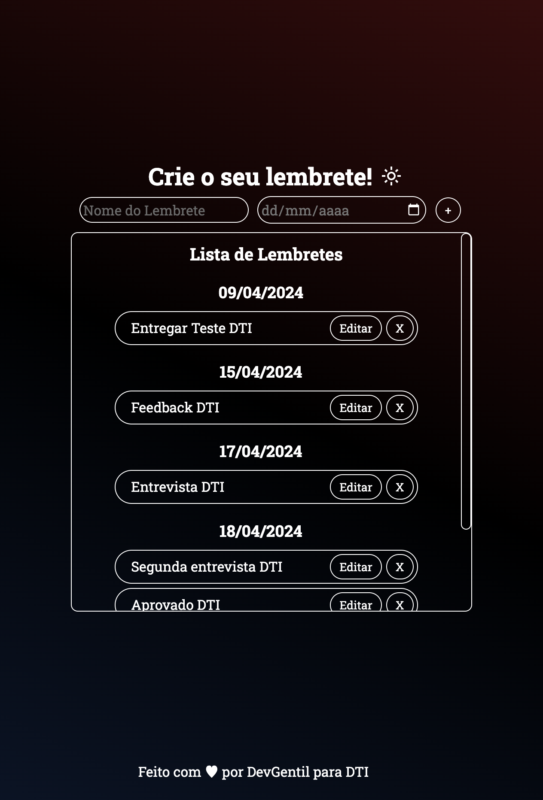
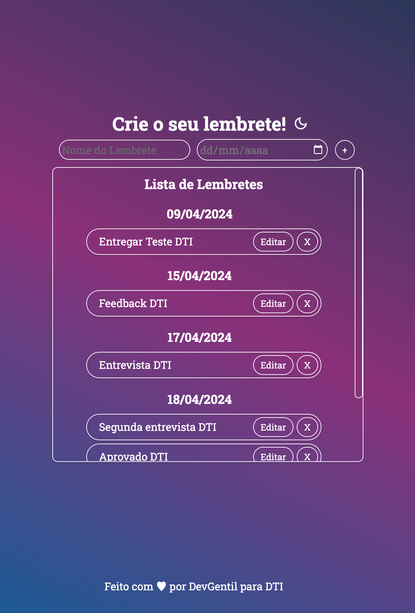

# Lembretes - Seu app de controle de tarefas

  
  

O Lembretes App é um aplicativo completo para gerenciamento de lembretes, dividido em um backend RESTful e um frontend React. Ele permite aos usuários criar, visualizar, editar e excluir lembretes.

## Funcionalidades Gerais

- **Criação de Lembrete**: Usuários podem adicionar novos lembretes.
- **Visualização de Lembretes**: Exibe todos os lembretes criados.
- **Edição de Lembrete**: Usuários podem editar lembretes existentes.
- **Exclusão de Lembrete**: Permite a remoção de lembretes indesejados.

## Componentes do Projeto

### Backend

O backend é uma API RESTful responsável por gerenciar os dados dos lembretes. Ela é construída com as seguintes tecnologias:

- Node.js
- Express.js
- Banco de Dados (MariaDB)
- TypeScript

#### Endpoints

- `GET /reminders`: Busca todos os lembretes.
- `POST /reminders`: Cria um novo lembrete.
- `DELETE /reminders/:id`: Apaga um lembrete.

#### Frontend

- React
- TypeScript
- Styled Components
- Testing Library

Feito com ❤️ por [DevGentil](https://github.com/DevGentil).
